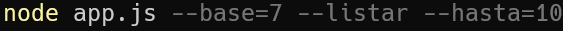
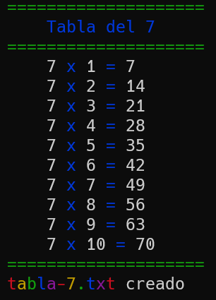
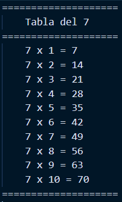

# Tabla de multiplicar

Aplicación en consola usando Node.js que calcula la tabla de multiplicar de un número, guarda el resultado en un archivo txt y lo muestra en consola si el usuario quiere.

## Entrada

> ### Comando de ejemplo


## Salida

> ### Consola


> ### Archivo


## Comandos de la aplicación

```
Options:
      --help         Show help                                      [boolean]      
      --version      Show version number                            [boolean]  
      -b, --base     Es la base de la tabla de multiplicar          [number] [required]  
      -h, --hasta    Este es el número hasta donde quieres la tabla [number] [default: 10]  
      -l, --listar   Muestra la tabla en consola [boolean]          [default: false]
```
## Instalation

> ### How to clone

`git clone https://github.com/derianrddev/node-tabla-multiplicar.git`
<br/>

> ### Install dependencies
`npm install`